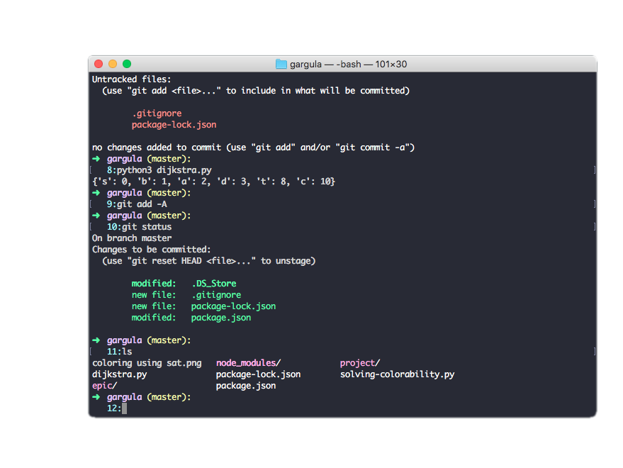

# Gargula

The best things of life are small cute details, so here is Gargula!

A minimalist Terminal interface to help you organize your work

Gargula includes only important data to display, to keep it simple and clean:

- Current directory
- Git Branch (if Git has been intialized)
- Operation number
- A nice arrow that indicates PS1 position

NOTE:
This example is using Dracula dark theme.   
Gargula has nothing to be with the theme(set of colors).   
If you like the theme used just Google Dracula Terminal theme

 

This is for the mac terminal

<h2>Installation: </h2>

Clone this repo  

Open the ps1 file with your text editor, copy the code(read commentaries to add what you need)

From the terminal open your .bash_profile, example atom ~/.bash_profile and paste the code 

The code includes: 

- Git script to display master branch

- The Gargula PS1 style

- Full color config for your terminal

Enjoy it!
