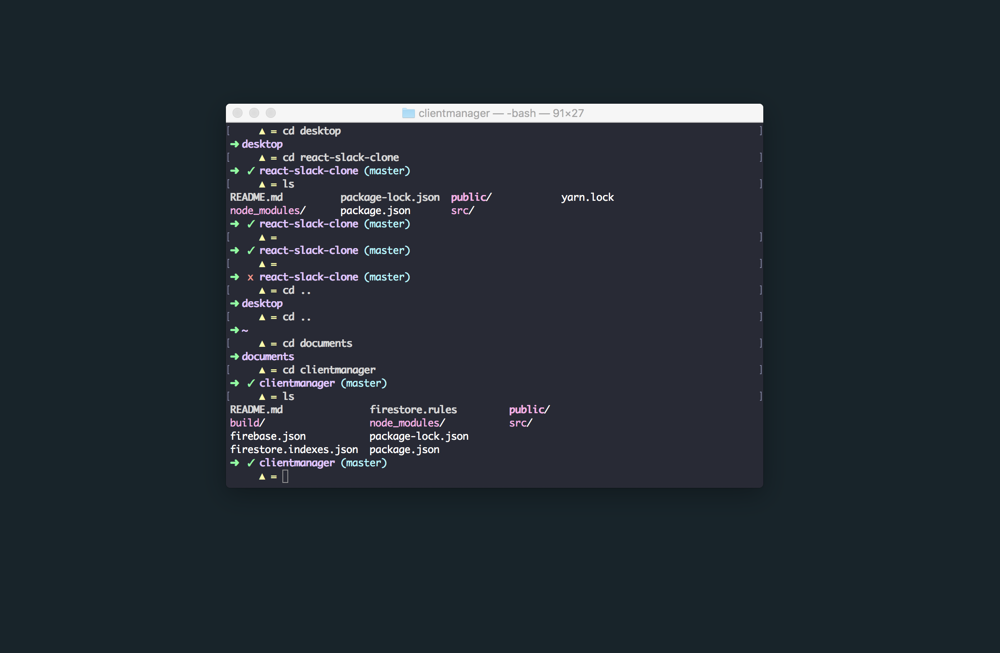
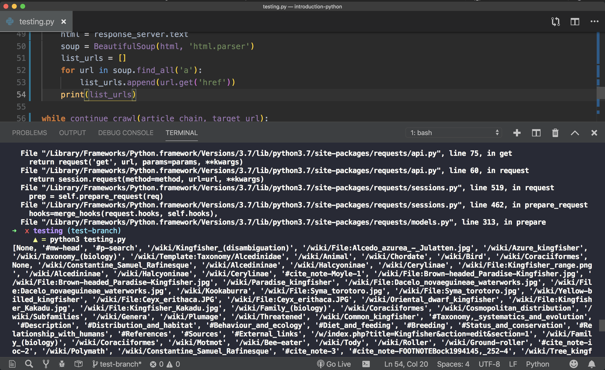

Gargula display, Git status, Git branch and more color to the terminal

<h2>It works with:</h2>

<h2>☑Hyper terminal</h2>
<h2>☑Native terminal</h2>

<h3>Gargula display only the important data</h3>

- Current directory

- Git Branch (if Git has been intialized)

- Git Status: 
       something to commit = 𝘟  
       nothing to commit = ✓

- Easy to find the next line

<h3>A minimalist Terminal interface for mac, to help you organize your work</h3>

 
 
<h3>Easy to find in a bunch of data</h3>

<h6> NOTE:
This example is using Dracula dark theme.   
Gargula has nothing to be with the theme(colors and combination).   
If you like the theme used just Google Dracula Terminal theme. </h6>

<h3>Contributions:</h3>

Any contribuition is more than welcome!   
Just contribute on a new branch "Development"

<h3>Installation: </h3>

Clone this repo  

Open the ps1 file with your text editor, copy the code(read commentaries to add what you need)

From the terminal open your .bash_profile, example atom ~/.bash_profile and paste the code 

The code includes: 

- Git script to display master branch

- Git script to diplay commit status

- The Gargula PS1 style

- Full color config for your terminal

<h3>Enjoy it!</h3>
