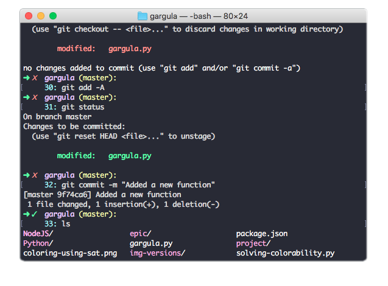

# Gargula

Gargula is a clean user interface for the Terminal with useful info  
No date or time that you can check with your watch and so on...

<h2>Gargula includes only the important data, to keep it simple and clean:</h2>

- Current directory
- Git Branch (if Git has been intialized)
- Git Status: something to commit = 𝘟   and   nothing to commit = ✓
- Operation number

A minimalist Terminal interface for mac, to help you organize your work

<h2>Contributions:</h2>

Any contribuition is more than welcome!   
Just contribute on a new branch "Development"

 

<h6> NOTE:
This example is using Dracula dark theme.   
Gargula has nothing to be with the theme(set of colors).   
If you like the theme used just Google Dracula Terminal theme. </h6>

<h2>Installation: </h2>

Clone this repo  

Open the ps1 file with your text editor, copy the code(read commentaries to add what you need)

From the terminal open your .bash_profile, example atom ~/.bash_profile and paste the code 

The code includes: 

- Git script to display master branch

- Git script to diplay commit status

- The Gargula PS1 style

- Full color config for your terminal

<h3>Enjoy it!</h3>
