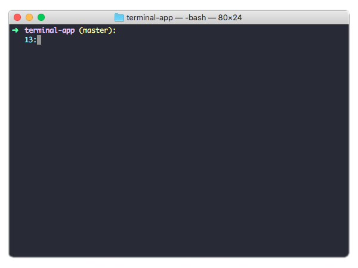
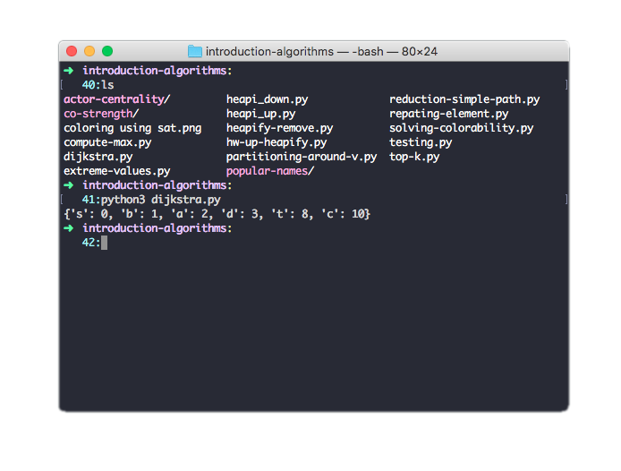

# Gargula
A clean PS1 config for your terminal to help you organize the work

Gargula includes only important data for your PS1:

- Current directory
- Git Branch (if Git has been intialized)
- Operation number
- A nice arrow that indicates PS1 position

This example is using Dracula dark theme, if you like this theme just Google Dracula Terminal theme

This is for the mac terminal

Installation: 

Fork the repo to your local 

Open the ps1 file with your text editor, copy all code 

From the terminal open your .bash_profile and paste the code 

The code includes: 

1- Git script to display master branch

2- The Gargula PS1 style

3- Full color config for your terminal
